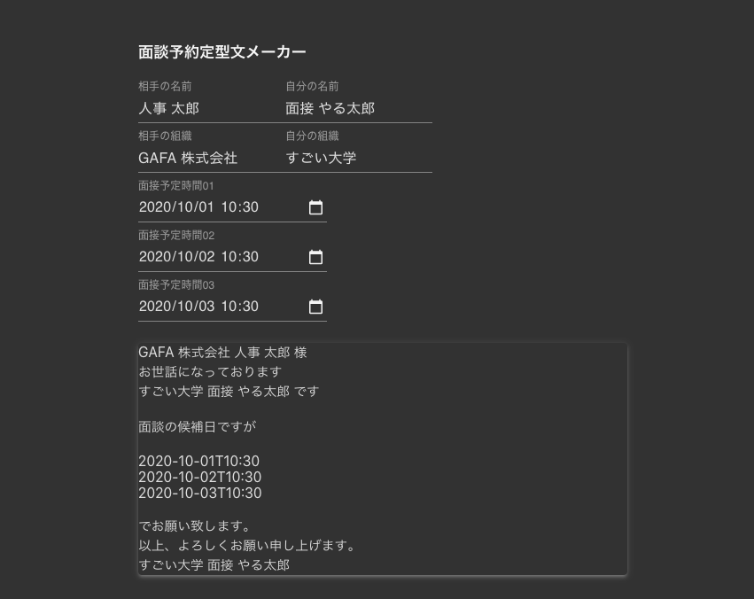

## 面談予約定型文メーカー

[https://kaede0902.github.io/easy-biz-email/](
https://kaede0902.github.io/easy-biz-email/)

* こちらから使えます。スマフォ対応済み！



面談の予約で毎回丁寧な言葉を打つの...面倒ですよね！！！

そんな時はこの 面談予約定型文メーカーを使いましょう！

これを使えば あなたは敬語なんて使わずに、

- 相手と自分の組織名
- 相手と自分の名前
- 面談候補日

を打ち込むだけで完璧な定型文章を整形してくれます！！

[https://kaede0902.github.io/easy-biz-email/](
https://kaede0902.github.io/easy-biz-email/)

煩わしいビジネスメールから解放されて、
爽やかな気持ちで面談に向かいましょう！！

--------

## なぜ作ったか

```
hogehoge 株式会社 bar 様
hoge 大学 foo bar です

お世話になっております
面接の日程ですが、
月: 10:00 - 19:00
水: 10:00 - 19:00
金: 18:00 - 19:00

でお願いします。
10/12, 10/14, 10/15, 10/19, 10/21, 10/22, になります

以上、よろしくお願い申し上げます。

hogehoge 大学 foo bar
```

* 面接落ちまくって、こう言うのを延々と書いているのが辛くなった
* 前々から hooks でinput から即座に反映するおもちゃを作りたかった

